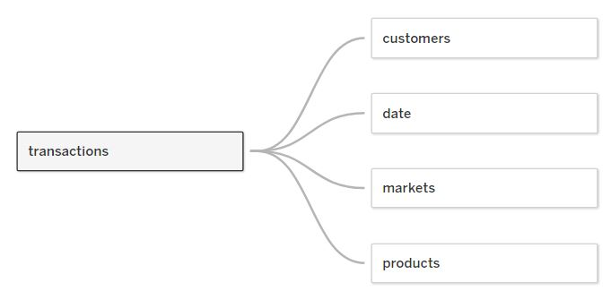
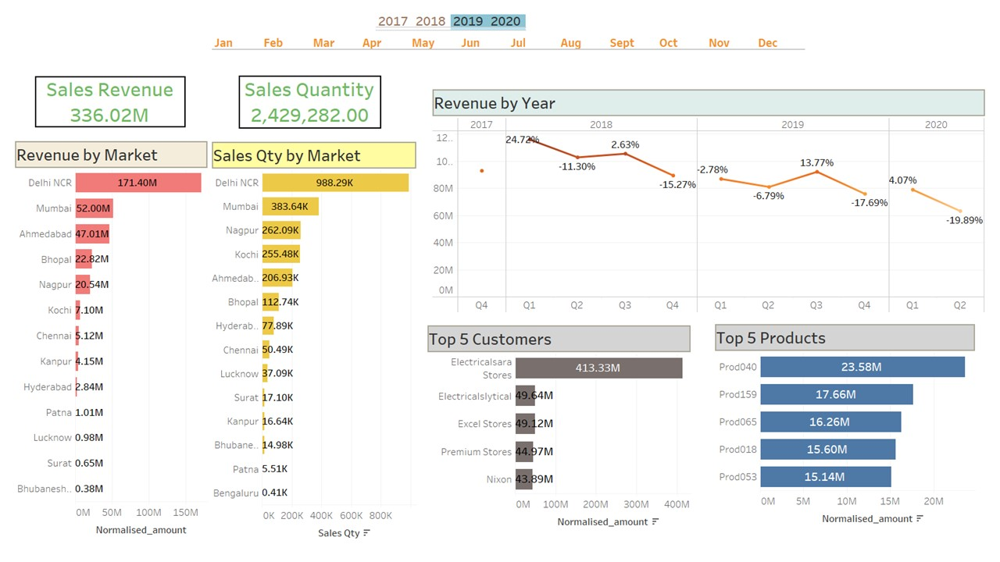
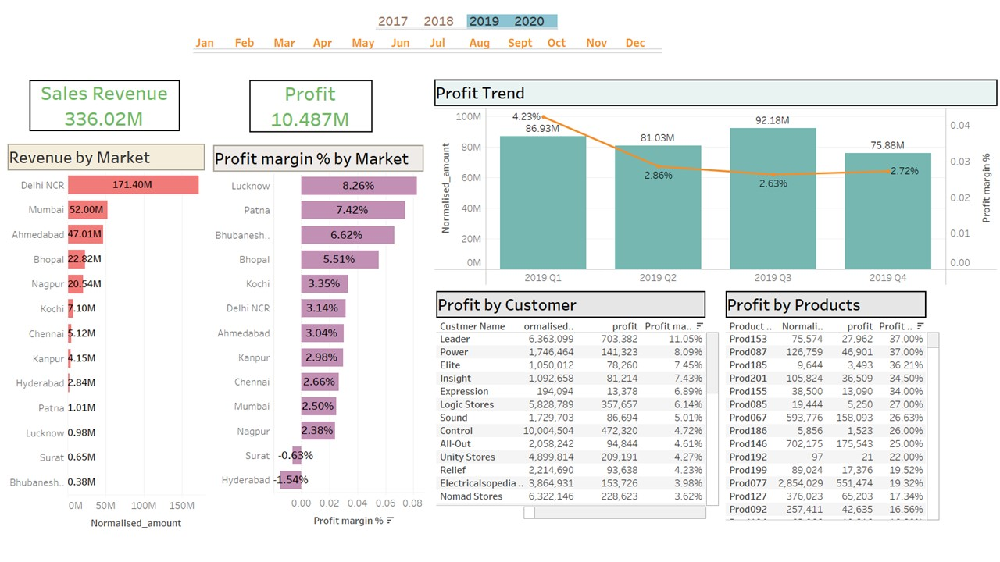

# ATLIQ-Sales-Insights

## About: 

* AtliQ Hardware is company that supplies computer hardware and peripherals to many clients across India. The company has a head office in Delhi and regional offices throughout India.
        
## PROBLEM STATEMENTS:
The sales director is facing a lot of challenges. The marketing is growing dynamically, he is struggling to keep track of the sales. He needs more accurate insights about the company sales and then makes the necessary decisions.

Sales director wants to know the performance of the company in various Indian states & accordingly provide some discount.

Q1. Revenue breakdown by cities.

Q2. Revenue breakdown by years & months. 

Q3. Top 5 customers by revenue & sales quantity.

Q4. Top 5 Products by revenue.

Q5. Net Profit & Profit Margin by Market.

### Technologies Used: 

•	Advance Excel

•	MySQL | SQL Server

•	Tableau

•	Statistics
        
### Steps Performed : 

•	Performed Data Cleaning, Analysing and Visualization on India based hardware company sales insights.

•	Developed ETL mappings using SQL to extract the data from unstructured data and 
    transformed it to the staging area to conduct data cleaning and design star 
    schema data model on Tableau.

•	Developed a Tableau dashboard to perform analysis, producing quantitative visualizations 
    in Tableau to draw valuable insights based on different parameters affecting the company 
    performance year on year and further provide business solutions.

----------------------------------------------------------------------------------------------------------------------------------------------------

## APPROACH - PROJECT PLANNING & AIMS GRID

1. Purpose: What? Why? What do we want to achieve?

        To unlock sales insights that are not visible before for sales team for decision support 
        & automate them to reduced manual time spent in data gathering.

2. Stake Holders: Who will be involved?
    
        •	Sales Director
        •	I.T. Team
        •	Customer Service Team
        •	Data & Analytics Team

3. End Result: What do we want to achieve?

        An automated dashboard providing quick & latest sales insights in order to support data driven decision making.

4. Success Criteria: What will be our success criteria?
    
         •	Dashboards uncovering sales order insights with latest data available.
         •	Sales team able to take better decision & prove 10% cost savings of total spend.
         •	Sales analysts stop data gathering manually in order to save 20% of their business time & reinvest it in value added activity.

## DATA ANALYSIS USING TABLEAU:

Tableau Public Dashboards: Revenue & Profit Analysis Tableau
Creating Star Schema in Tableau

### Tableau Dashboard: Revenue Analysis

### Tableau Dashboard: Profit Analysis

## Final Report
Based on the dashbaords insights, I have made some conclusions and recommendation that Sales Marketing team should/can consider making a sales strategy.

### Conclusions
* Sales were rapidly decreasing in 2020 compared to 2019 by around 57.7%.
* Highest revenue generated from Markets such as Delhi NCR, Mumbai, Ahmedabad, Bhopal, Nagpur, and so on where as Bangalore, Bubhaneshwar and Surat have been at all time low revenue generated marters.
* Highest quantities sold in the Market such as Delhi NCR, Mumbai, Nagpur, Kochi, Ahmedabad, and so on.
* Across the years, the top 5 customers have been Electrical SaraStores, Electricalslytical, Excel Stores , Premium Stores and Nixcoh.
* In terms of Profit Margin %, 2019 had the highest PM% at 3.12%
* Overall, eventhough Surat has been on the low revenue generation side, it has highest Profit Margin % at 4.86% on the other hand, Delhi NCR that has highest revenue generation has a PM% of only 2.3%.
* Bangalore has seen the worst market at profit margin of -20.78 %.
* In 2020, eventhough Delhi has given the most revenue, it was Bubhaneshwar who was the most profitable market at 10.48%
* Leader was the most profitable customer across the years at profit margin of 7.54% amd in 2020 Electricalsbea stores had highest PM % at 15.63%
* Product 001 and Product037 are top two with highest PM % at 39% and 38% respectively.
* Product 080 and Product 022 are bottom two lowest PM% with -35% and -30% respectively.

### Recommendation
* Considering 2019 and 2020, focus more on sales improvement in Lucknow, Surat and Bubhaneshwar as these have very low revenue. Especially Surat because it has lowest Profit Margin of Negative (-0.19%).
* Need to check costs of operations in Surat since loss have been incurred in 2019 and 2020 combined.
* Maintain good relationship with customers with overall high PM% like leader and in 2020, it was Electricalsbea. Maybe try giving them discounts?
* Make campgain strategy for mid year as they are showing high sales among other months.
* Even though, Delhi and Mumbai share top two spots for Revenue generation and Sales quantity, their Profit Margin % is pretty low. Need to revise additional costs or operations costs so that the profits can be maximised

